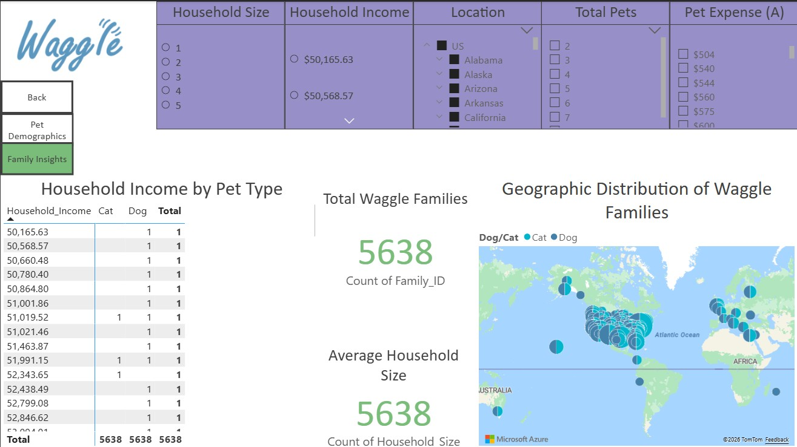
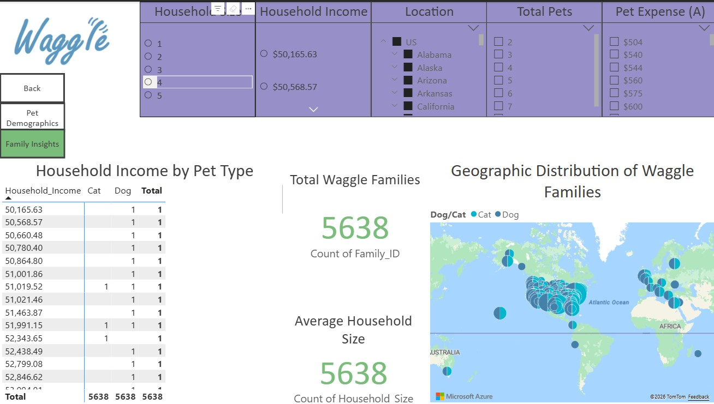
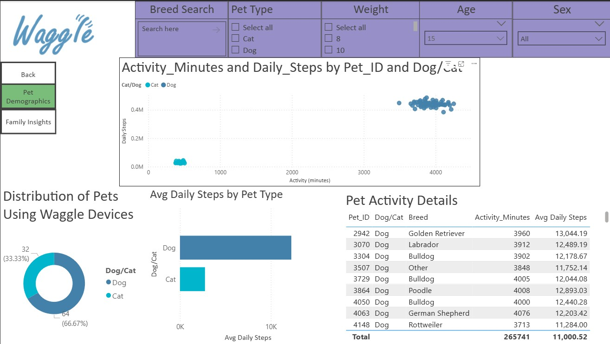

# Waggle – Power BI Interactive Dashboard

## Overview
This project is an interactive Power BI dashboard built for a fictional pet technology company, **Waggle**, designed to analyze customer demographics, household composition, and pet ownership trends.  
The goal of this dashboard is to demonstrate business intelligence skills including data modeling, DAX measures, and interactive reporting.

## Business Questions
- How do customer household types differ across regions?
- What trends exist between family composition and pet ownership?
- Which demographic segments represent the highest engagement opportunities?

## Dashboard Features
- Interactive slicers for demographic and household attributes
- Drill-down and cross-filtering across visuals
- KPI-style summary visuals for quick insights
- Clean, business-focused layout optimized for decision-making

## Data
This dashboard uses **synthetic / fictional data** created specifically for portfolio purposes.  
No real customer or proprietary data is included.

## Tools & Skills
- Power BI Desktop
- Data modeling (star schema)
- DAX measures
- Data visualization & storytelling
- Business intelligence best practices

## How to View
- Interactive version: <https://app.powerbi.com/reportEmbed?reportId=84dc865a-3ac0-4d39-abd4-08d152e26274&autoAuth=true&ctid=cfa792cf-7768-4341-8857-81754c2afa1f&actionBarEnabled=true&reportCopilotInEmbed=true>
- PBIX file: (add link here if included in repo)

## Screenshots

### Main Dashboard

### Family Insights

### Pet Demographics

